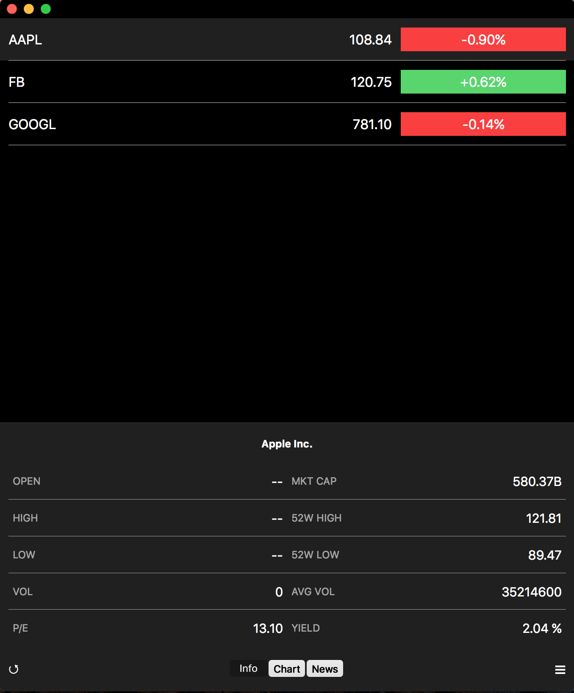
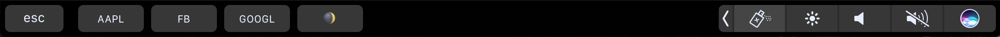

# FinanceMacOSReactNative

 

iOS's Stocks App clone written for MacOS with Touch Bar supported. Data is pulled from [Yahoo Finance](finance.yahoo.com).

## Download

## App preview

#### Screenshot

#### Application

#### Touch Bar

## React and React Native version

* [react](https://github.com/facebook/react): 15.3.2
* [react-native-macos](https://github.com/ptmt/react-native-macos): 0.10.5

## Plugins used

* [mobx](https://github.com/mobxjs/mobx) - Simple, scalable state management.
* [mobx-react](https://github.com/mobxjs/mobx-react) - React bindings for MobX.
* [react-native-simple-store](https://github.com/jasonmerino/react-native-simple-store) - A minimalistic wrapper around React Native's AsyncStorage.
* [react-native-touchbar](https://github.com/ptmt/react-native-touchbar) - TouchBar for react-native-macos.
* [react-router-native](https://github.com/jmurzy/react-router-native) - A routing library for React Native that strives for sensible API parity with react-router 🤖.

## Related project

* [FinanceReactNative](https://github.com/7kfpun/FinanceReactNative) - iOS's Stocks App clone written in React Native for demo purpose (available both iOS and Android).

## Running

#### Prerequisites

* Xcode 8.1 on macOS Sierra 10.12.1 (12B2657) or later

#### Clone & install

* Clone this repo `git clone git@github.com:7kfpun/FinanceMacOSReactNative.git`
* `cd FinanceMacOSReactNative`
* run `npm install`

#### Start

* Run `open macos/Finance.xcodeproj`

## License

Released under the [MIT License](http://opensource.org/licenses/MIT).
